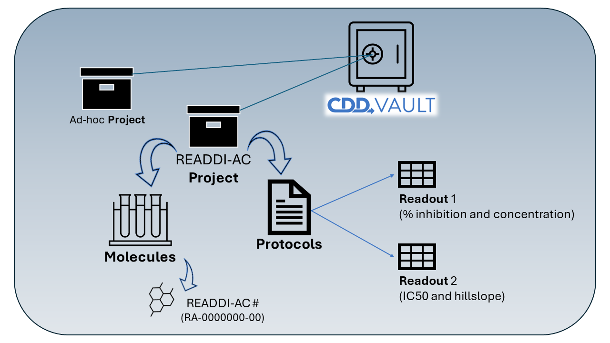
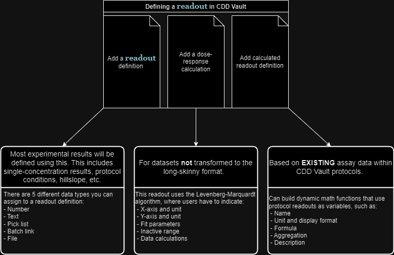
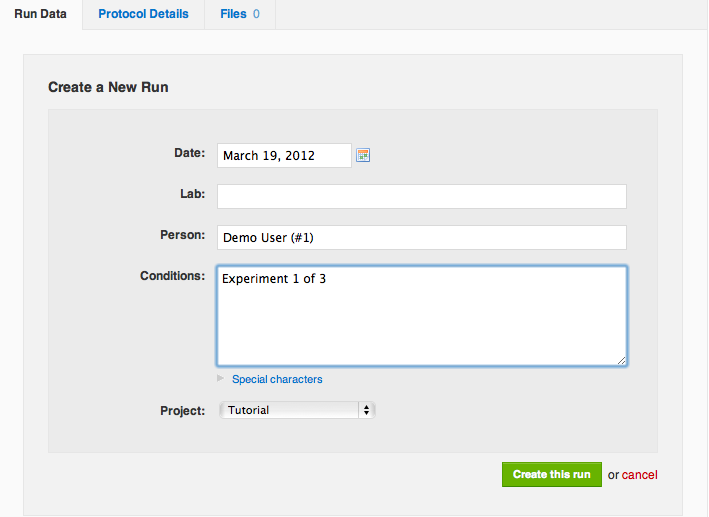

# CDD Vault Guide

Data uploads in READDI-AC leverage CDD Vault in order to streamline data management and collaboration. The platform supports efficient data handling, integration, and analysis, enhancing virological research.
This section will provide guidance on understanding CDD Vault's structure.

When it's ready ----->  **View a recording of the CDD Vault UNC READDI: Kick-Off**

## Understanding Projects
In the context of READDI-AC, a CDD **Project** serves as a shared space where team members can access and collaborate on data sets that are interconnected. Think of it as a designated area within a digital library, where all the research data relevant to a specific subject or collaborative effort is stored and managed. This organization aids in streamlining collaboration and ensuring that pertinent data is easily accessible and shareable among those who need it.

For READDI-AC, there is one primary **Project** where most of the collaborative work and data sharing will take place. This central Project is where team members across different research areas and functions can store, access, and share their data, fostering an integrated and cooperative research environment.

However, we understand that some labs may handle sensitive or proprietary data that requires additional confidentiality due to legal or intellectual property considerations. In such instances, READDI-AC is prepared to establish dedicated **Project** for these labs. These specialized **Project** will have enhanced restrictions to safeguard the sensitive data, ensuring that it is only accessible to authorized personnel and that it complies with any legal restrictions. This approach allows labs to participate fully in the collaborative environment of READDI-AC while maintaining the necessary level of data protection and compliance.

When you first log into CDD Vault, your access and navigational options will depend on your role. Vault administrators can view and manage all project memberships and are responsible for granting access to the necessary **Project**. If you need access to any specific **Project** or if you are handling sensitive data and require a separate **Project** setup, please reach out to Ava by [filling out this form](contact_us.md) where you can indicate any special data handling needs.

[CDD Vault Project Knowledge Base link](https://support.collaborativedrug.com/hc/en-us/articles/214357843-1-Logging-in-and-navigation#first_project) (what is a Project)

## Understanding Protocols
Protocols in CDD Vault are essentially templates for experiments. They define how to structure and record the data you gather from your assays. When setting up a Protocol, you'll detail the conditions, what you're measuring, and how you want to process the data. This could include calculations for averages, IC50 curves, and any specific grouping of results. Protocols ensure consistency across experiments and help maintain the integrity and context of your research findings.

For the READDI-AC project, all imported data will be stored within the designated READDI-AC Project space in CDD Vault. Within this space, data is organized by specific Protocols that reflect the lab and assay name. This organizational structure ensures that data is not only accurately categorized but also easy to retrieve and analyze.

### READDI-AC Protocol Categories
Data imported into the CDD Vault is meticulously structured within the READDI-AC Project framework, with data organized under Protocols tailored to specific lab and assay names. To cater to diverse study requirements, Protocols are classified into four distinct types. A template for each protocol category is provided under the description. 

+ **Cell-based assays:** uses live cells to examine biological responses to various substances, such as drugs, chemicals, or biological compounds. These assays are crucial for understanding the effects of these substances on cell health, function, proliferation, and death. They can be used to assess efficacy, toxicity, and mechanism of action of therapeutic candidates.
[View template](assets/files/CDD Vault_protocol_cell-basedassay_fields.pdf)

+ **Target-based assays:** are designed to study the interaction between a potential drug candidate and a specific biological target, which is typically a protein (e.g., enzyme, receptor) implicated in a disease. The goal is to assess the ability of the substance to modulate the activity of the target, either by inhibiting or activating it. These assays are fundamental in early drug discovery phases to identify and optimize compounds with desired biological activity.
[View template](assets/files/CDD Vault_protocol_target-basedassay_fields.pdf)

+ **Animal studies:** aka in vivo studies involve using non-human animals to evaluate the biological and pharmacological effects of substances in a complex living organism. These studies provide valuable information on the efficacy, toxicity, pharmacokinetics, and pharmacodynamics of therapeutic candidates. Animal models are selected based on their relevance to human physiology and the disease being studied.
[View template](assets/files/CDD Vault_protocol_animalstudy_fields.pdf)

+ **Physiochemical properties assays:** encompasses the study of the physical and chemical properties of substances, including solubility, stability, molecular weight, and form (solid, liquid, gas). Understanding these properties is crucial for drug formulation, delivery, and development, as they influence a drug's absorption, distribution, metabolism, and excretion (ADME) profiles. Physicochemical properties assays help optimize drug candidates for better efficacy, safety, and patient compliance.
[View template](assets/files/CDD Vault_protocol_physicochemical_fields.pdf)

[CDD Vault Protocols Knowledge Base link](https://support.collaborativedrug.com/hc/en-us/articles/214357903-Glossary-of-common-terms#protocol) (Protocol)

## Understanding Molecules
While protocols organize the workflow and data processing steps, molecules represent the chemical entities being studied within these protocols. The relationship between protocols and molecules is symbiotic; protocols provide the methodological framework, while molecule data delivers the substance for analysis, ensuring reliability and consistency in your experimental results.

### Molecule Registration and ID Management
As a data uploader or investigator within the READDI-AC project, understanding the role and management of molecule data is crucial.

+ **Molecule Registration:** Data uploaders are not required to register molecules directly. The molecular structures typically associated with the READDI-AC project, including those used in various assays across different labs, have already been imported and registered within the system. This foundational step ensures that all subsequent data associated with these molecules are accurately captured and cataloged.

+ **Molecule IDS and SMILES Strings:** Molecules have a unique READDI Batch ID following the format of RA-XXXXXXX-XX, which can be registered with a structure (SMILES string) or structure-blinded. When preparing datasets for upload, **ensure that there is a dedicated column for READDI IDs**, linking each data point distinctly to its corresponding “RA” number.

+ **Handling Unrecognized Molecule IDs:** If CDD Vault flags an unrecognized READDI ID during data upload or analysis, it is vital to address this promptly. Please reach out to our Stewardship team and include Anwar Hossain (anwar.hossain@unc.edu) to investigate. Our team is equipped to assist in troubleshooting and resolving any issues with molecule IDs, ensuring seamless integration and analysis of your data within the platform.

## Understanding Readouts

In the context of the READDI-AC project, protocols within the CDD Vault serve as foundational structures to systematize and manage your experimental data, including readout definitions which represent various result types. These result types can range from raw experimental data to calculated metrics like % Inhibition or Z-score, ensuring consistent data organization. 

Defining readouts within CDD Vault protocols has **three key options:**

+ **Readout Definition:** This is the primary method we'll use, capturing specific data points or measurements from an assay. This readout type allows users to specify the data type they are uploading:
    + **Number**: the most common data type for HTS data. Only numeric values with modifiers (>, <, >=, <=) are permitted. This means that things like N/A or "precipitated" are not allowed. 
    + **Text**: alphanumeric values are permitted. Qualitative results and hyperlinks should also be entered as this data type.
    + **Pick List**: a predefined list of alphanumeric values that may be entered for this readout. Gives the protocol owner the ability to control the values that are imported into the vault. Data such as phenotypes, descriptions, cell lines etc. should be defined as pick lists. Note, that you cannot calculate across pick-list values! Learn more about pick lists.
    + **Batch Link**: allows linking Batch records to other entities stored in the same or across separate CDD Vaults (if the Link Across Vaults feature is enabled for your CDD Account).
    + **File**: file attachments of any file type and size.  Image previews will be generated for JPG, GIF, BMP, PNG, TIFF and PDF formats. All other files will be available for download to view with their native software.

+ **Calculated Readout Definition:** Useful when you need to derive averages or other statistical measures from existing Readouts in the protocol, like ‘Average % Inhibition’ either within or across runs.

+ **Dose-Response Calculation:** Employed for analyzing data that is uploaded as individual x- and y-axis datapoints with a range of concentrations or doses to determine values like IC50, IC90 or CC50, typically using the Hill equation.

[CDD Vault Readouts Knowledge Base link](https://support.collaborativedrug.com/hc/en-us/articles/214357903-Glossary-of-common-terms#readout_definition) (readouts)

[Understanding long-skinny format](http://127.0.0.1:8000/datamgmtguide_READDI-AC/data-upload_guide/#transforming-dataset-into-long-skinny-format-for-cdd-vault-upload)

### Understanding Conditions
CDD Vault allows researchers to manage varying experimental conditions within a single assay protocol, such as cell line, expression type, and species. Instead of creating multiple protocols for each variation, a single protocol can be used to handle different conditions simultaneously. This approach enables the averaging and calculation of results based on these conditions. When a protocol readout definition is designated as a condition, it categorizes related results for calculated readout definitions within that protocol, enhancing data organization and analysis efficiency.

When you want to analyze the data, CDD Vault can calculate results for each unique set of conditions. For example, conditions allow the user to calculate the Average % Inhibition or EC50 for a specific cell line or drug concentration.

Moreover, if you have multiple conditions, CDD Vault will analyze every possible combination. So, if you're looking at two species (e.g.,  mice and rats) and two cell lines (e.g.,  HK-2 and MKt-1), the Vault will give you results for each pairing: 
+ mice with HK-2, 

+ mice with MKt-1, 

+ rats with HK-2, 

+ and so on. 

This level of detail helps you pinpoint exactly how different variables affect your outcomes.

[CDD Vault Conditions Knowledge Base link](https://support.collaborativedrug.com/hc/en-us/articles/214357903-Glossary-of-common-terms#readout_definition:~:text=of%20data%20analysis.-,Condition,-Condition%20is%20a) (condition)

## Understanding Runs
A run signifies a distinct instance of an experiment guided by a specific protocol, encapsulating the unique data derived from each assay execution in the lab. Whenever you conduct an experiment following a protocol and upload its results to CDD Vault, you create a run tied to that protocol. Multiple experiments carried out on the same day under identical conditions can each be logged as separate runs within the same protocol, a system feature that ensures meticulous data organization and facilitates precise tracking of experimental details and outcomes.

Runs are organized by date, and you may back-date it, if you are importing data several days after performing the actual experiment. The best practice is that the run date you add to your CDD Vault matches the experiment date in your lab notebook.

[CDD Vault Runs Knowledge Base link](https://support.collaborativedrug.com/hc/en-us/articles/214359683-Importing-data-for-several-runs-on-the-same-day) (run)
