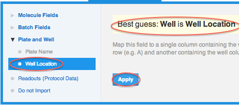
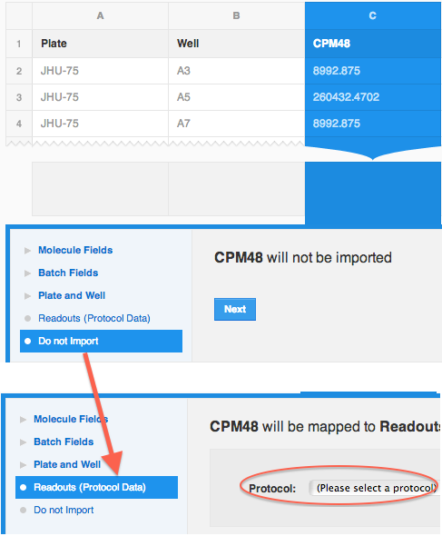

# Data upload guide

## Importing files
For successful data integration into CDD Vault, precise definition of protocol readouts is crucial to ensure accurate variable mapping. Uploads must conform to a **long-skinny format** - _see [example image below](#transforming-dataset-into-long-skinny-format-for-cdd-vault-upload)_, with dedicated columns for RA-#######-## (_READDI ID_) and corresponding readout values. This structure is essential for correct data mapping and maintaining data integrity in CDD Vault. For further information, consult the [CDD Vault Knowledgebase resource site](https://support.collaborativedrug.com/hc/en-us/articles/214357923-3-Importing-Single-Point-Screening-Data#readout_definition).

!!! info "Jump to:"
    [**CDD Vault's tutorial**](https://support.collaborativedrug.com/hc/en-us/articles/214358183-How-do-I-format-a-file-for-import) on importing files. (Not READDI-AC-specific)
    
    [**READDI-AC-specific step-by-step guide on importing your data**](#step-by-step-guide-on-importing-your-data) on importing files.

 _Continue reading along for more details regarding READDI-AC specific data types structure._ 

### Tabular data
Your tabular data can either be added as a:

- **Readout definition** _(if your raw dataset does <u>not</U> need further calculations, i.e. EC50 calculation was already conducted, this is the most common readout you will encounter)_
- **Dose-response calculation**
- **Calculated readout definition** 

If you have **corresponding non-tabular data files associated with the tabular data**, please follow the guidelines described in the [step-by-step guide on importing your data.]((#step-by-step-guide-on-importing-your-data))

### All other data types
_Ask Ava to clarify how to store other files that are **not** related to the tabular data imported_

- Add as "File" type in **Readout Definition**??

## Setting-up a protocol

!!! info "Jump to:"
    [**CDD Vault's tutorial**](https://support.collaborativedrug.com/hc/en-us/articles/214357923-3-Importing-Single-Point-Screening-Data#protocol_setup) on protocol set-up. (Not READDI-AC-specific)

    For an in-depth explanation of **Protocols**, see [Understanding Protocols](cddvault.md/#understanding-protocols) section. 

### Step-by-step guide on creating a new protocol

+ **Step 1:** Log in to CDD Vault and ensure you have access to the **READDI AViDD** Project (or an ad hoc project specific to your study)
+ **Step 2:** Navigate to the **Explore Data** tab and locate **Create a new protocol** 
    
    

+ **Step 3:** Double check you're in the correct **Project** and select a protocol template based on your assay by clicking the **Form drop down**. 
_
 Remember there are 4 protocol templates for READDI-AC. See [READDI-AC Protocol Categories](cddvault.md/#READDI-AC-Protocol-Categories) for more info regarding selecting the appropriate protocol category for your assay type. 
_
    
+ **Step 4:** Follow this **Protocol Name** nomenclature structure: **INVESTIGATOR LAST NAME** - **VIRUS TARGET** - **ASSAY TITLE**

    !!! note "Protocol Name Example"
        Arrowsmith - SARS2 nsp 13 ATPase - Dose-Reponse

+ **Step 5:** Fill out the rest of the form, ensuring the required(*) fields are complete, but the more info the better!
+ **Step 6:** Attach SOP using the **Upload a file** button. 
        
    

+ **Step 7:** Click **Create Protocol**
        
    

## Step-by-step guide on setting-up a readout

!!! info "Jump to:"
    [**CDD Vault's tutorial**](https://support.collaborativedrug.com/hc/en-us/articles/214357923-3-Importing-Single-Point-Screening-Data#readout_definition) on setting up a readout. (Not READDI-AC-specific)

    For an in-depth explanation of **Readouts**, see [Understanding Readouts](cddvault.md/#understanding-readouts) section.
### Creating or editing a new readout
+ If you just recently created the protocol, you'll now have the option to assign readouts to your protocol. 

+ If you are adding a new readout to an _**existing** protocol_ you can follow along with these steps as well by first navigating to the protocol and editing the readouts under the **Protocol Details** tab. 
    

!!! info "Remember, there are 3 options for assigning readouts, this guide below will go through all three options."
    [Readout definition](#readout-definition)

    [Dose-response calculation](#dose-response-calculation)

    [Calculated readout definition](#calculated-readout-definition)

#### Readout definition 
Selecting **Add a readout definition** will allow the user to associate the dataset to a defined readout. Note that most data types will fall under this category, e.g., **single-concentration results** (_i.e., % inhibition, titer reduction, % viability_) and **protocol conditions** (_i.e.,concentration, virus, cell line_). 

+ **Step 1**: Add the variable **Name**. 
+ **Step 2**: Select **data type**. For this readout type, there are **5 different data types** that you can select from. _See [Understanding Readouts](cddvault.md/#understanding-readouts) section for more info on data types._ 

    

    + **Number** data types:
        + **Step 2.N.1** Add Unit
        + **Step 2.N.2** Add Display Format: the standard is 3 significant figures
        + **Step 2.N.3** Add description: Note any transformations that your dataset has undergone and other useful information regarding your dataset here. 
        + **Step 2.N.4** Select **Do not normalize this readout**
        + **Step 2.N.5** Don't forget to click **update readout** once complete
    
        **IC50 Readout Example**
        
    
    + **Text** data types:
        + guide goes here
    
    + **Pick list** data types:
        + **Step 2.PL.1** click on **Edit Pick List**
        + **Step 2.PL.2** a new light-box window will pop up, where you can manually type values one at a time, or  or copy/paste an entire list of values.
        + **Step 2.PL.3** click **enter** after every manually entered value. Or simply copy/paste a list where entries are placed on different rows.
        + **Step 2.PL.4** click on **update picklist** once complete. 

        **Virus pick list readout example**
        
    
    + **File** data types:
        + guide goes here
    
    + **Batch Link** data types:
        + guide goes here

#### Dose-response calculation
Adding a **dose-response calculation** will present the user with the form shown below to build a calculation using the Levenberg-Marquardt algorithm used to fit a Hill equation to dose-response data. Note that if you already performed calculations **outside** of CDD Vault, then you will <u>**not**</u> use this readout, but instead use the **[add readout definition](#readout-definition)** option.

+ **Step 1**: Fill in the form working from top to bottom. Start by defining the raw data to be imported, followed by data normalization, fit parameters and validation, and finally the calculated end-point. 
+ **Step 2**: Ensure that the **display format** of the data calculations is in **3 significant figures**
+ **Step 3**: Don't forget to click **add/update calculation** at the bottom of the form. 

**Dose-response calculation example**

#### Calculated readout definition
Calculations are based on existing assay data within your CDD Vault protocols, as well as chemical properties of the registered compounds, and numeric constants. In this manner, you can build dynamic mathematical functions that use protocol readouts as variables, and are automatically updated when new raw data is imported into the Vault.

Calculations are defined as new readouts in existing protocols, based on previously defined readouts. In a new protocol, calculations will be added after the initial set of raw data readout definitions.

+ **Step 1**: Chose to add a calculated readout definition. _Note that if you don't see the formula box as shown below, you do not have access to advanced calculations. [Contact your CDD representative](contact_us.md) or support to enable this._
    
+ **Step 2**: Provide a name for the calculated readout definition (one that does not conflict with any other readout names in this protocol).
+ **Step 3**: Fill in the formula in the provided formula builder.
+ **Step 4**: Always select **average by batch and run** aggregation.
+ **Step 5**: Add description as deemed necessary.
+ **Step 6**: Don't forget to click **update or save calculated readout definition** at the bottom of the form.

**Calculated readout example**

## Step-by-step guide on importing your data
**Before iniating the upload process, ensure that the following conditions have been met:**

+ ✓ A protocol exists in the system with the appropriate readouts assigned
    + For instructions on creating a new protocol, click [here](#setting-up-a-protocol) 
+ ✓ Your data set is in a long-skinny format. 
    + For assistance with transforming your dataset into a long-sknny format, click [here](#dataset-transformation)

[Contact a READDI Steward](contact_us.md) if you're having issues with any of these pre-requesites. 

### Tabular data 

+ **Step 1**: Choose data file (and project). Note that at the very minimum, your file should contain structures and required batch fields. 
+ **Step 2**: On the Import Data tab, upload your import file and choose your project. Make sure to select the right project, or the protocol name will not be available for mapping in the next step.
    
+ **Step 3**: Map fields. Make sure that the "Add readouts (protocol data) only" option is selected.
    + _**If applicable** step_: Map the plate and well columns. When a column in the file preview pane is highlighted, CDD Vault will make an attempt to guess your mapping based on the provided file header. If the guess is correct, all you have to do, is click "apply". If the guess is not correct, change the mapping in the section below the file preview pane.  
    
+ **Step 4**: Map assay data. All assay data is mapped under the **Readouts (Protocol Data) section**. When this is selected there is a series of drop-downs that appear each time you make a selection. Note that if CDD Vault could not provide a best guess for the mapping, "**Do not import**" is automatically selected. Change "**Do not import**" to "**Protocols (Readout Data)**" option. Select the appropriate readout definition from the drop-down.
    
+ **Step 5**: Click on **Create a new run** and fill the form. The data from the import file is going to be added to a new [**run**](cddvault.md/#understanding-runs) of a protocol. Ensure to describe any relevant info about the data in the "Conditions" section. 
    + _**If applicable** step_: Upload related files in this step (e.g. graphs, images, etc.). You'll see an option to attach additional files.  
+ **Step 6**: Click on **Create this run**, and then finalize the mapping by clicking **Apply** 
    + _**If applicable** step_: Repeat the steps 3 to 6 to map other variables in the same input dataset. 
+ **Step 7**: Click on **Process File**. You'll see a yellow progress bar at the top which will provide an indication how the the initial import is progressing. Once the initial stage is completed, you will see a QC or import validation report.
    
    

+ **Step 8**: Review the QC import validation report, this report will give clues if something is invalid. At this stage the data have not been written into your vault, and you may simply "reject" or cancel the entire import, or any of the events you see. Once the file is "committed", it means the import is finalized and it is more difficult to undo (though not impossible). 
+ **Step 9**: If the report looks promising, click on **Commit Data Import**. When the commit step is finished, the import report will update one more time, providing quick links to review, QC or visualize the data.
    + **If in doubt: REJECT Data Import**. You can always start the import again without much work, but it may take some work to delete all of the erroneously entered data after it's committed.
+ **Step 10**: When the import is finished, review the newly updated data by navigating to the **Run Page**--> **Data Summary** tab. 

### Non-tabular data
!!! warning "Please note:"
    This portion of the webpage is still under construction!

[CDD Vault database on attaching non-tabular data as .zip files.](https://support.collaborativedrug.com/hc/en-us/articles/7109670098324-Attaching-Files-in-CDD-Vault)

## Dataset transformation
This section explains how to modify your dataset to meet the requirements for uploading to CDD Vault. It is essential that your Excel file includes a column labeled **RA #** which corresponds to the READDI Batch ID in CDD Vault. This setup is crucial for the proper mapping of variables and readouts in the system.

### Transforming dataset into long skinny format for CDD Vault Upload
To prepare your dataset for upload to CDD Vault, it's important to format it in the long-skinny format. Here’s how to effectively achieve this:

**Understanding Long-Skinny Format**

The long-skinny format organizes data with one column per variable and each row representing a single observation. This method is ideal for handling large datasets where each row can be a unique combination of variables.

**Step-by-Step Instructions**

+ **Step 1** Adjust Sheet Placement: Ensure that the dataset's first sheet is the one you intend to upload. CDD Vault will only read the first sheet of your file.

+ **Step 2** Organize Columns According to Protocol Readouts: Include columns for all variables defined in your protocol's readout specifications. Arrange these columns to reflect the data accurately and consistently.

+ **Step 3** Include a Column for READDI ID: Ensure there is a designated column for the READDI ID. This identifier is crucial for tracking and associating data within the CDD Vault system.

### Automating splitting comibined datasets (large excel files) into individual files
Navigate to this [GitHub repository](https://github.com/lmaefos/data-transformation/blob/master/megafile_split.ipynb) for the python script on automating the process of dividing a large Excel dataset into multiple smaller Excel files.