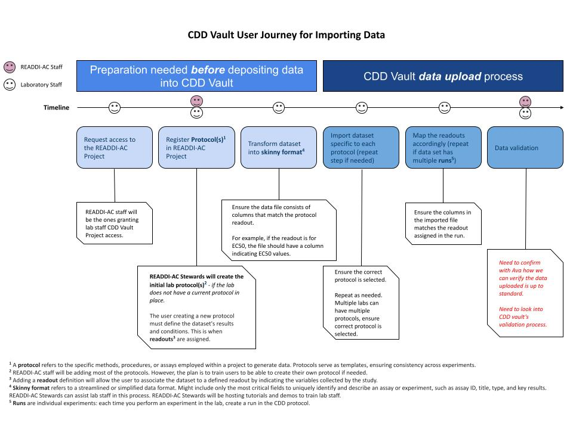

# Data management timeline

The READDI project's data management timeline is divided into two key phases. 

+ **_Phase one:_ Preparation Before Depositing Data,** ensures that users have CDD Vault access, data is properly formatted, adheres to standard protocols, and is ready for upload, maintaining data integrity and consistency. 
+ **_Phase two:_ CDD Vault Data Upload Process,** entails the actual data entry into the CDD Vault, confirming accurate categorization and future analysis readiness. This methodical process promotes efficient data management and utility in the READDI project.
